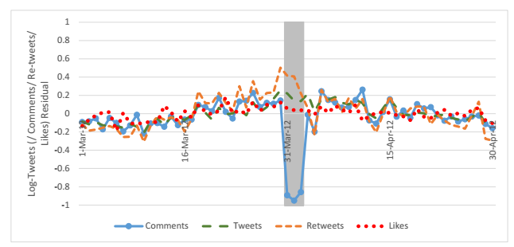
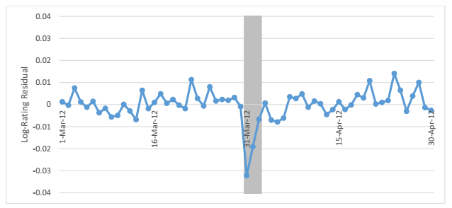
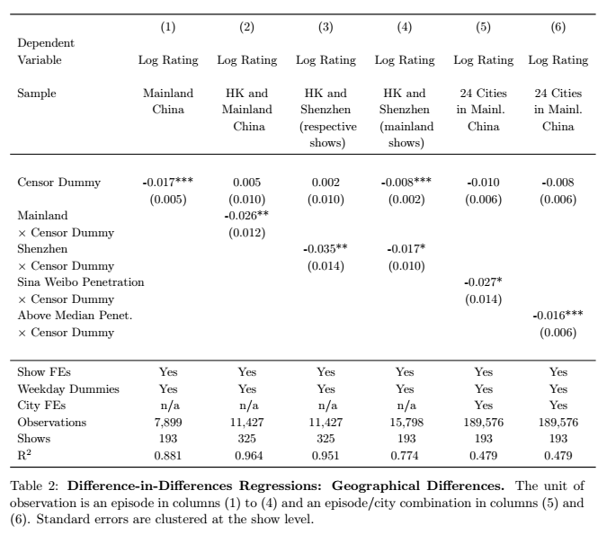
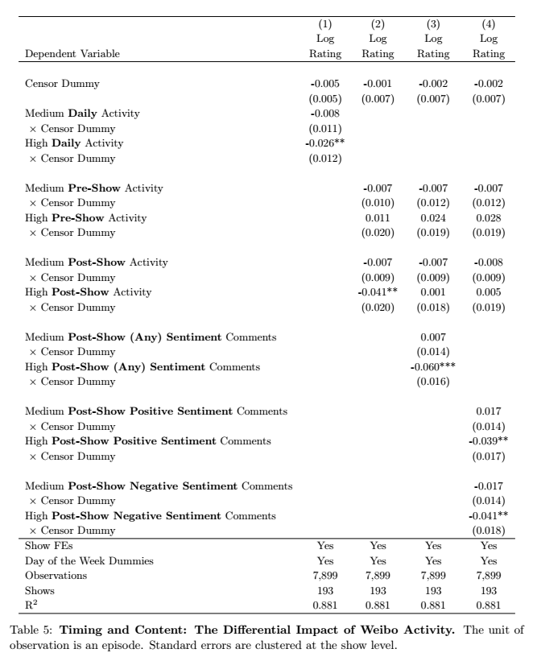
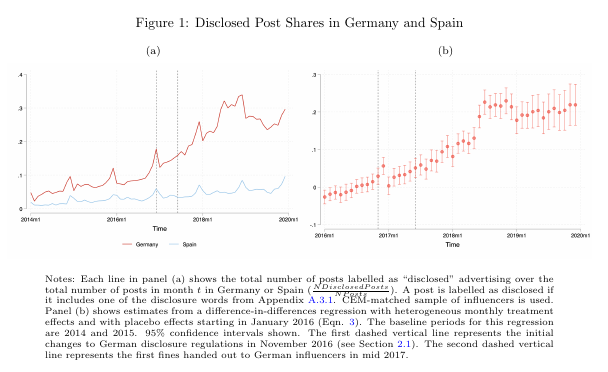
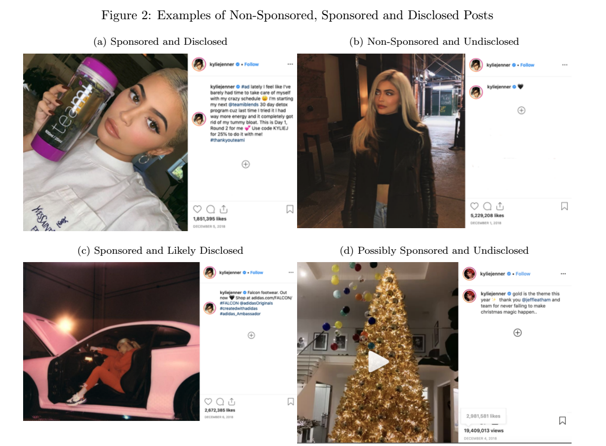
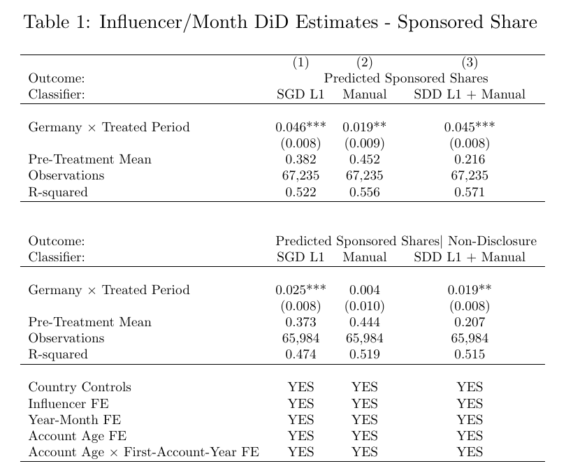
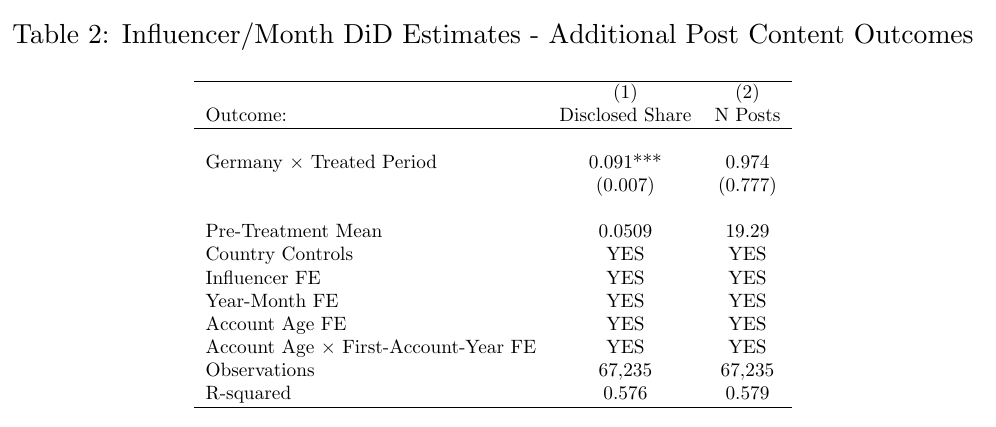
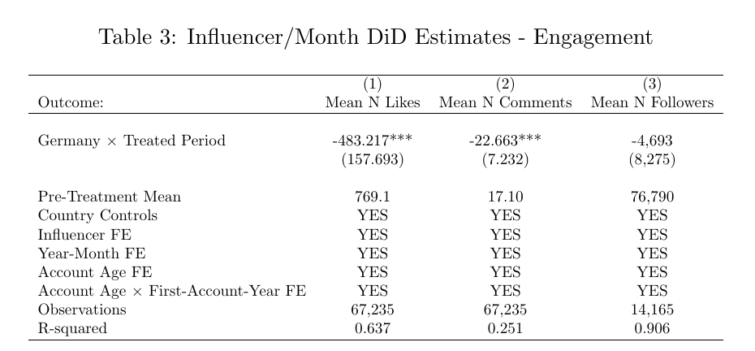

class: font160

# Learning Goals for this Week

* Describe mechanisms through which consumer word of mouth can impact product demand and explain the results of a natural experiment designed to estimate the effect size
* Explain how to quantify the effect of influencers on product demand and  describe the relative effectivess of sponsored content on demand relative to organic content 
* Discuss the importance of follower counts of influencers on their posts impressions and describe how to select influencers based on their follower counts
* Outline how sponsorship disclosure impacts influencer posting behaviour and consumer engagement with their posts

---
class: inverse, center, middle

# Preliminaries

---
class: font160
# Where Are We Now? 

```{r, echo = FALSE, fig.align = "center", out.width="35%"}
url <- "figs/pngtree-pile-of-cartoonish-cute-doodle-theme-books-png-image_6871556.png"
knitr::include_graphics(url)
```

Course Themes:

1. `r icons:::icon_style(icons::fontawesome("check", style = "solid"), scale = 1)` Measuring Advertising Effects
2. **User Generated Content & Social Media**
  * `r icons:::icon_style(icons::fontawesome("check", style = "solid"), scale = 1)` Online Reviews
  * `r icons:::icon_style(icons::fontawesome("bullseye", style = "solid"), scale = 1)` Word of Mouth & Influencers

---
class: font160
# Today's Topic Coverage

Does consumer online word-of-mouth increase demand? How?

* [Seiler, Yao and Wang (2017)](https://pubsonline.informs.org/doi/abs/10.1287/mksc.2017.1045)

Do influencers impact product demand?

* [Huang & Morozov (2023)](https://papers.ssrn.com/sol3/papers.cfm?abstract_id=4065064)

Which type of influencer should a firm choose?

* [Tian, Dew & Iyengar (2023)](https://rtdew1.github.io/tiktok.pdf)

What are the effects of influencer disclosure regulations?

* [Ershov & Mitchell (2024)](https://drive.google.com/file/d/1uCmHOTdUodWg71a2x69LKkldyhnG52VA/view)

---
class: inverse, center, middle

# Consumer Word of Mouth

---
class: font160
# What is Word of Mouth Marketing?

Consumer's interest in a company's product or service is reflected in their "daily dialogues"

* Why is this *new* in "social media"?
  * It isn't a new idea ...
  * The "social web" with it's increasing connectivity makes it more salient
  * ... and measurable

---
class: font160
# Types of Word of Mouth 

**Organic word of mouth**:

* Consumers become advocates for a product and have a desire to share their views.
* **This is our focus**

**Amplified word of mouth**: 

* Marketers launch campaigns designed to encourage or accelerate WoM in existing or new communities.
* We'll come back to this later in the course -- "Firm Generated Content"

**Online versus Offline**

* Distinction is always lurking in the background

---
class: font160
# Social Media Word of Mouth Matters

* Consumers now spend more than **135 mins per day on social media**
    - Social media sites contain a treasure-trove of decision relevant information

* **Social Media fostered growing importance of WoM marketing**

* **Chief Marketing Officers think online WoM matters**
    - ... Rationalized by consumer's trust in online info from peers (Nielsen, 2013)
    - 64% of marketing executives believe word of mouth is the most effective form of marketing
    - Only 6% say they have mastered it.

---
class: font160
# Why Word of Mouth Might Matter

Three mechanisms at play:

1. Awareness
2. Buzz
3. Social learning
4. Consumption complementarities

Most often we see:

* Awareness & Buzz $\rightarrow$ volume of tweets
* Social learning $\rightarrow$ sentiment in tweet's text
  * Sentiment often called valence

---
class: font160
# Tweet Volume Measures Awareness and Buzz

* **Awareness**
    * Introduces new consumers to a product
    * Reminds consumers about product
    * Reinforce traditional advertising
* **Buzz**: expressions of *anticipation*
    * Increase in anticipation $\rightarrow$ increase in volume of posts
        * By consumers who want to act as opinion leaders, and reflect their interests, excitement, and expectations
        * Generally "neutral" in sentiment

---
class: font160
# Sentiment Measures Quality

* **Sentiment** expressed tweet's text provides **means to measure** (consumer perceptions of) **quality**
* Sentiment **impacts sales via social learning**
    * (Dimensions of) Quality revealed through interactions with their peers
    * Relevant if consumers use these reviews to decide what to attend

* **Remark**: Important to control for other ways consumers learn about quality

---
class: font160
# When Should it Matter?

- Social media can generate awareness, buzz and information diffusion that ultimately influences demand
- Important when:
    1. Relying on "hyped release strategies"
    2. Uncertainty about a product's quality
- Examples: movies, books, consumer electronics, video games, fashion

.center[**Most relevant for new products early in release**]

---
class: font160
# Online WoM & Causality

**Strategic Question**: Does consumer word of mouth impact demand? What are the mechanisms driving the shift?

**Challenge:** Causal inference is particularly difficult in the realm of online WOM due to the fact that firms are not directly in control of the amount of WOM.

* Hard to run a field experiment

**How?**: Natural experiment -- shutdown if Sina Weibo due to political events in mainland China but not HK

* Sina Weibo $\approx$ Chinese Twitter

---
class: font160
# Empirical Approach

**Industry**: TV show viewership -- dramas

* Not really **new** products

**Data**:

* TV ratings (i.e. viewership) at episode/city level in mainland China and HK
* Microblogging activity about each show

**The Natural Experiment**: Censorship block on Sina Weibo

* Large, random shock, unrelated to TV
* Block in mainland China, **but not** HK

---
class: font160
# Difference in Differences

$$
\begin{aligned}
LogRating_{jt} = \alpha Block_{t}  &+ \beta Mainland_{j} + \delta_j Block_{t} \times Mainland_{j} \\ 
                                   &+ Weekday_t' \gamma + \varepsilon_{jt}
\end{aligned}
$$


* **Treatment Group**: Chinese TV Viewers $\rightarrow$ `Mainland`
* **Control Group**: Hong Kong TV Viewers
* **Before/After**: Date relative to the censorship block  $\rightarrow$ `Block`

.center[
We care about the value of $\delta$
]

---
# Graphical Evidence I

```{r, echo = FALSE, fig.align = "center", out.width="100%"}

```

---
# Graphical Evidence II

```{r, echo = FALSE, fig.align = "center", out.width="100%"}

```

---
# Diff in Diff Results

```{r, echo = FALSE, fig.align = "center", out.width="75%"}

```

---
# What is the Mechanism?

```{r, echo = FALSE, fig.align = "center", out.width="50%"}

```

---
class: font160
# Takeaways

* Estimated Volume elasticity: between 0.016 and 0.026

* WoM influnces demand via consumption complementarities 
  * Can chat about it later online

* Managerial Implications:
  * Fostering post-show discussion
  * Doesn't appear to be valence/sentiment effects 
    * (maybe because quality is known?)

---
class: font140
# Recent Developments

.center[
**How far to "believable" numbers can get get without experimental variation?** 

**Can we reconcile the volume vs sentiment debate?**
]

* If we can **control** for (almost) all the omitted variables
* Studied by [Deer, Crawford, Chintagunta (2022)](https://papers.ssrn.com/sol3/papers.cfm?abstract_id=4227912) 

**Setting**: US Movie Industry & Twitter WoM, i.e. **new** products

**Findings**: 

* Distinguish Pre- vs Post- release volume and sentiment
* Volume **and** sentiment significant
* Small(-ish) volume elasticities, larger sentiment elasticities 
* Differs across **types** of movies
  *  Buzz: Franchise movies, 
  *  Awareness: (expected) mid-tier movies, 
  *  Social learning: (expected) small movies

---
class: inverse, center, middle

# Influencer Marketing


---
class: font160
# What is Influencer Marketing?

> **Influencer Marketing**: A type of social media marketing that uses endorsements and product mentions from influencers

**Who are influencers?** Someone who has:

* Power to affect the purchasing decisions of others because of his or her authority, knowledge, position, or relationship with his or her audience
* A following in a distinct niche, with whom he or she actively engages

**Types of influencers**:

* How niche they are: products / target audience 
* How large there reach is: mega, macro, micro, nano 

---
class: font150
# The Influencer Market: Stylized Facts 


* **Large and growing**, approx 9.7 billion USD in 2020
  * 2016: 1.7 billion USD, 2025: (expected) > 20 billion USD

* **Approx. 3/4 companies use influencer marketing** to some extent, mainly Instagram
  * **Only 65%** of those who use it, **track ROI**

* Becoming 'centralized' through influencer marketing agencies 
  * Interesting incentive problems here...

* Large **growth in the use of "micro" influencers** 

* Growing concern: **compliance issues**
  * Only approx 20% of (US/UK) posts meet regulatory guidelines

<!--- 
borrowed roughly from here https://influencermarketinghub.com/influencer-marketing-benchmark-report-2020/
--->

---
class: inverse, center, middle
# Do influencers impact product demand?

---
class: font160
# Motivation

**Strategic Question**: What is the effectiveness of influencer marketing on generating consumer demand? 

**Why relevant?**

* (Over-) Excitement about influencer marketing 
* Limited evidence beyond anecdotes 
* It's **hard** to measure, but **worth** trying

**Methods**:

* No experiment but **clever empirical strategy**  
* $\implies$ think of most estimates as **causal**

**Application**: Twitch & Video Games 


---
# Twitch

```{r, echo = FALSE, fig.align = "center", out.width="100%"}
url <- "figs/video_ads_twitch.png"
knitr::include_graphics(url)
```

---
class: font160
# What we want to know 


.center[How **Viewership of streams impacts demand**]

`r icons::fontawesome("question", style = "solid")` Why won't linear regression suffice?


---
class: font160
# The Key Idea of the Paper 

.font120[*Ideal Experiment*]:

**Activate streamers** at **random times** to generate **exogenous variation** in **viewers** 

.font120[*Paper's "best" approximation*]:

* Variation in timing of when top streamers broadcast
* ... that should be independent of shocks to game popularity
* Essentially exploiting that streamers work "irregular" hours


---
class: font140
# Model Free Evidence

```{r, echo = FALSE, fig.align = "center", out.width="100%"}
url <- "figs/video_ads_modelfree.png"
knitr::include_graphics(url)
```

Observations:

* Players does not immediately peak 
* Slowly returns to baseline

$\implies$ potential for short-lived effects on game usage

---
class: font140
# Empirical Strategy

Regression Equation:

```{r, echo = FALSE, fig.align = "center", out.width="80%"}
url <- "figs/video_ads_regression.png"
knitr::include_graphics(url)
```

where: 

```{r, echo = FALSE, fig.align = "center", out.width="35%"}
url <- "figs/video_ads_viewerstock.png"
knitr::include_graphics(url)
```

i.e. is a weighted sum of recent viewers ...

* where the eights decay geometrically, over time 
* Set T = 72 hours (!!)

$\delta$ $\rightarrow$ persistant effect of viewership 

* "carryover" relative to "immediate" effects

---
class: font140
# Empirical Strategy

**How do they use streamer's timing of broadcast?** 

* Technically: **instrumental variables**
* To overcome omitted variable bias and simultaneity
* See diagram in class ... 

What are the instruments?

* **Number of top streamers broadcast game $j$ at time $t$**
  * Measure this for **each of the last 12 hours**


---
class: font140
# Main Results

```{r, echo = FALSE, fig.align = "center", out.width="80%"}
url <- "figs/video_ads_main_results.png"
knitr::include_graphics(url)
```

Findings: 

* **Small**, positive & statistically significant effects $\rightarrow$ $\beta$
  * Interpret!
* Effect **persists over time** $\rightarrow$ $\delta$


---
class: font140
# Heterogeneity in Effect Sizes

```{r, echo = FALSE, fig.align = "center", out.width="95%"}
url <- "figs/video_ads_heterog_dist.png"
knitr::include_graphics(url)
```

---
class: font140
# Heterogeneity Across Products

```{r, echo = FALSE, fig.align = "center", out.width="85%"}
url <- "figs/video_ads_heterog.png"
knitr::include_graphics(url)
```

Largest Effects: 

* **Small** publishers 
* **High variance** in ratings 
* **Older** games  

---
class: font140
# Sponsored Versus Organic 


```{r, echo = FALSE, fig.align = "center", out.width="80%"}
url <- "figs/video_ads_sponsored.png"
knitr::include_graphics(url)
```

$\omega < 1$ $\rightarrow$ **sponsored content** effectiveness is a fraction of organic 

* **15.7% as effective as organic streams!**

---
class: font140
# Cascades 

```{r, echo = FALSE, fig.align = "center", out.width="80%"}
url <- "figs/video_ads_cascades.png"
knitr::include_graphics(url)
```

Cascades: sponsored stream generates additional organic content

---
class: font140
# Cascades 

Suppose a top streamer is sponsored to broadcast:

* **Directly increases viewership** by $\hat{\theta}_1$
* **Induces** an additional $\hat{\theta}_1 \hat{\gamma}$ to **organic broadcasters** 
* Which **generates**  $\hat{\theta}_1 \hat{\gamma} \times \hat{\theta_2}$ **more viewers**
* ...

```{r, echo = FALSE, fig.align = "center", out.width="70%"}
url <- "figs/video_ads_cascades_totaleffect.png"
knitr::include_graphics(url)
```

*End result* (Viewers): 

* Induces approx. 3 organic streams 
* Which is 2.6 times as many viewers than sponsored stream

*End result* (Sales):

* 1.6 sales per 1000 viewers

---
# Return on Investment (ROI)

```{r, echo = FALSE, fig.align = "center", out.width="50%"}
url <- "figs/video_ads_roi_formula.png"
knitr::include_graphics(url)
```

```{r, echo = FALSE, fig.align = "center", out.width="60%"}
url <- "figs/video_ads_roi.png"
knitr::include_graphics(url)
```

* Median game has additional revenue of $19.50 due to sponsored streams
  * Median ROI = -95%
* 16% of games have positive ROI 
* 90th percentile has ROI of 138% 

$\implies$ **sponsored influencer promotions are mostly ineffective**

---
class: font160
# Takeaways 

* **Small, positive effects** of organic influencer content **on demand** 
  * Similar in magnitude to OWoM volume and advertising 
  * ... which helps these numbers feel credible 

<br>

* **Sponsoring influencers** leads even **smaller effects** (approx 1/5th!)
  * But does lead to cascades of organic content 

<br>

* **ROI** for sponsored content is **negative for 2/3rds of games**

---
class: inverse, center, middle
# Which type of influencer should a firm choose?

---
class: font160
# Motivation

**Strategic Question**: How do an influencer's impressions vary with follower counts? 

**Why relevant?**

* Influencers typically paid according to follower base
* Different types $\rightarrow$ different effects
  * Mega: awareness 
  * Micro: consideration, intent, purchase 

**Application**: TikTok's Discover page

* "trending content" for > 200 hashtags
* Over six months

---
class: font150
# Model Free Evidence 

```{r, echo = FALSE, fig.align = "center", out.width="80%"}
url <- "figs/tiktok_modelfree.png"
knitr::include_graphics(url)
```

.center[Want a **non-linear** relationship between followers and impressions]

`r icons::fontawesome("question", style = "solid")` How would you go about answering the problem?
`r icons::fontawesome("question", style = "solid")` What would be your "ideal experiment?"


---
class:font150
# The Authors' "Ideal" Experiment 

Imagine a **company knows the type of influencer** they want to hire

<br>

* Suppose **many "identical" influencers** of this type, but **vary only by followers count** 

* Could **collaborate with each at different points in time**

* Measure the **effect of followers on impressions** 

* This **traces out the relationship** they're interested in

<br>

`r icons::fontawesome("question", style = "solid")`Is this *really* the optimal experiment?

---
class:font160
# What the authors actually do 

The thought experiment that underpins their analysis: 

* **Many potential influencers** that a company can collaborate with
  * Who **create similar content**, match desired "influencer profile"
  * **Vary in follower counts** 

* Assume the "exchangability" of influencers 


`r icons::fontawesome("rocket", style = "solid")`If company paid for more followers, would campaign metrics have differed?


---
class: font150
# Collecting Data from Posts

`r icons::fontawesome("question", style = "solid")` How to get data from posts?

```{r, echo = FALSE, fig.align = "center", out.width="70%"}
url <- "figs/tiktok_posts.png"
knitr::include_graphics(url)
```

`r icons::fontawesome("question", style = "solid")` Why do they need this?

---
class: font150
# Collecting Data from Posts

**Answer 1**: Machine learning

```{r, echo = FALSE, fig.align = "center", out.width="50%"}
url <- "figs/tiktok_ml_posts.png"
knitr::include_graphics(url)
```

Extracts the "data":

* Text 
* Image 
* Audio 
* Editing style

**Answer 2**: In class...

---
class: font150
# Estimating Follower Elasticities 

**Estimating equation**:

$$log(Impressions_j) = g(log(Followers_{ij}), ControlVariables_j) + e_j$$

**Challenge**:

* Follower counts likely correlated with unobservables (in the $e_j$)

$\implies$ need some extra work to claim causality 

**Solution**: "An extra modelling equation"

* Explains $log(Followers_{ij})$ via likes of *similar* content creators 

<br>

.font70[**Remark**: This won't be in the exam ... it's quite subtle]

---
class: font140
# Main Result


```{r, echo = FALSE, fig.align = "center", out.width="80%"}
url <- "figs/tiktok_avg_fei.png"
knitr::include_graphics(url)
```

**Key Takeaways**: 

* U-shaped
* Largest follower elasticity at 6,500 followers
* Similar magnitudes* to advertising effectiveness

---
class: font140
# Role of Engagement Tactics


```{r, echo = FALSE, fig.align = "center", out.width="80%"}
url <- "figs/tiktok_engagement_tactics.png"
knitr::include_graphics(url)
```

**Key Takeaways**: 

* Less than 10K followers: informative content leads to more impressions 
* Large follower base: "socializing" content leads to more impressions
  * Though less effective *on average*
* Entertaining content similar effect as informational

---
# Influencer Type Counterfactuals

.pull-left[
```{r, echo = FALSE, fig.align = "center", out.width="100%"}
url <- "figs/tiktok_counterfactuals.png"
knitr::include_graphics(url)
```
]
.pull-right[
**S-shaped**: "Special Effects" focussed campaign

* Only catches on if popular enough influencer posts it

<br>

**Concave**: Product Demonstration focussed campaign

* Niche audiences for this content

<br>

**Linear**: Self Expression focussed campaign 

* Broad appeal to all audiences
* This is the most frequent in the data
]

---
class: font160
# Optimal Influencer Selection

```{r, echo = FALSE, fig.align = "center", out.width="100%"}
url <- "figs/tiktok_optimal_influencer.png"
knitr::include_graphics(url)
```

Assume value/impression and cost per 1K followers 

$\rightarrow$ optimal number of followers for a campaign

---
class: font150
# Takeaways

* If campaign focused around "social content" and socialization: influencers with a higher follower count

* If campaign focused around information: lower follower counts 
  * Why? Trust and authenticity

* Once we can quantify elasticity of impressions with respect to followers, we can establish the optimal follower count to target for a new campaign
  * Conditional on knowing cost per followers *and* assuming value generated per impression 


---
class: inverse, center, middle

# Effects of Influencer Advertising Disclosure Regulations


---
class: font160
# Influencers as Advertisers

**Strategic Question**: What do advertising disclosure regulations do to positng behavoiur of influencers and consumer content engagement?

**Why Relevant?**

* Sponsored influencer posts is still the "wild west" of advertising
  * i.e. unregulated, left to consumers to discern 
  * Unlike most advertising markets
* Increase regulation mandated by governments ...
* ... But actual uptake is still low

**How are we going to answer the question?**: Natural Experiment on Instagram

* Introduction of disclosure laws

---
class: font160
# The Experiment & Regression

The **Natural Experiment**: Introduction of strict Ad Disclosure Laws

* **Before/After**: New laws passed in Germany in late 2016 $\rightarrow$ `Treated Periods`
* **Treated Group**: Germany influencer market $\rightarrow$ `Germany`
* **Untreated Group**: Spanish influencer market

Data: 6,000 local influencers in Spain and Germany

The **regression framework**:

$$y_{it} = \alpha Germany_i \times Treated Periods_t + \beta X_{it} + \delta_i + \delta_t + \varepsilon_{it}$$

We are interested in $\alpha$

---
# Disclosure Patterns

```{r, echo = FALSE, fig.align = "center", out.width="85%"}

```

---
# Detecting Disclosure?

```{r, echo = FALSE, fig.align = "center", out.width="85%"}

```

---
class: font140
# Disclosure Before & After


```{r, echo = FALSE, fig.align = "center", out.width="65%"}

```

* Increase in share of disclosed sponsored content, between 2 and 4.6 percentage points
* PLUS an unintended consequence: share of undiscloses also increases

---
class: font140
# Disclosure Before & After


```{r, echo = FALSE, fig.align = "center", out.width="95%"}

```


---
# Engagement Metrics


```{r, echo = FALSE, fig.align = "center", out.width="110%"}

```

---
class: font160
# Takeaways

* Advertising disclosure regulation has real effects 
  * Disclosure rates of sponsored posts increase after regulation introduced 
  * Important given skepticism about its impact

* But, engagement per post falls (on average) 

* What we still don't know: Does the type of content an influencer posts change after the introduction of regulation?

---
class: inverse, center, middle
# Recap 

---
class: font140
# Summary

* Consumer WoM has small positive impacts on consumer demand
  * Magnitudes are much smaller than previously thought

* Organic influencers have small, positive effect on demand
* Sponsored content appears to have negative ROI (on twitch, in gaming)
  * More work needed to generalize this

* Quantifying causal relationship between followers and impressions of an influencer is difficult 
  * But allows us to choose the "right" influencer for a campaign 
  * (with additional assumptions)

* Disclosure regulation increases disclosure rates of sponsored posts
  * But decreases consumer engagement

---
# License & Citation

Suggested Citation:

```{r, engine='out', eval = FALSE}
@misc{deerdsms2024,
      title={"Digital and Social Media Strategies: Word of Mouth and Influencers"},
      author={Lachlan Deer},
      year={2024},
      url = "https://github.com/deer-marketing-lab/dsms-lecture-wom-influencers"
}
```

<p style="text-align:center;"></p>

This course adheres to the principles of the Open Science Community of Tilburg University. 
This initiative advocates for transparency and accessibility in research and teaching to all levels of society and thus creating more accountability and impact.

<p style="text-align:center;"></p>
This work is licensed under a <a rel="license" href="http://creativecommons.org/licenses/by-sa/4.0/">Creative Commons Attribution-ShareAlike 4.0 International License</a>.